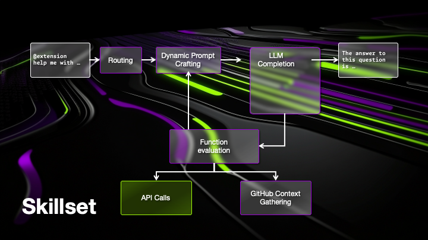
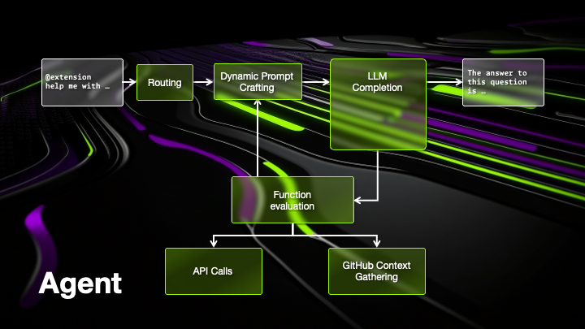

# gh-extension-demo
This repo describes how to create extensions for GitHub Copilot using .Net.

There are 2 examples. Both using C# and .Net to implement a GitHub Copilot Extension to demonstrate the different options how to build extensions

## Skillset Example 
The first example is a skillset that exposes the basic weather api that comes out of the box when generating a new .Net API and exposes that as a skill to GitHub copilot to show how you can turn any API into a GitHub Copilot Extension Skillset.

## Agent Example
The second example is an agent implementation of a GitHub Copilot Extension. This example shows how you can build an agent where you have full control of the complete interactions with Copilot and LLM models. In this example we use C# and Semantic Kernel to control the flow of the extension and add a plugin to order pizza from your copilot.

